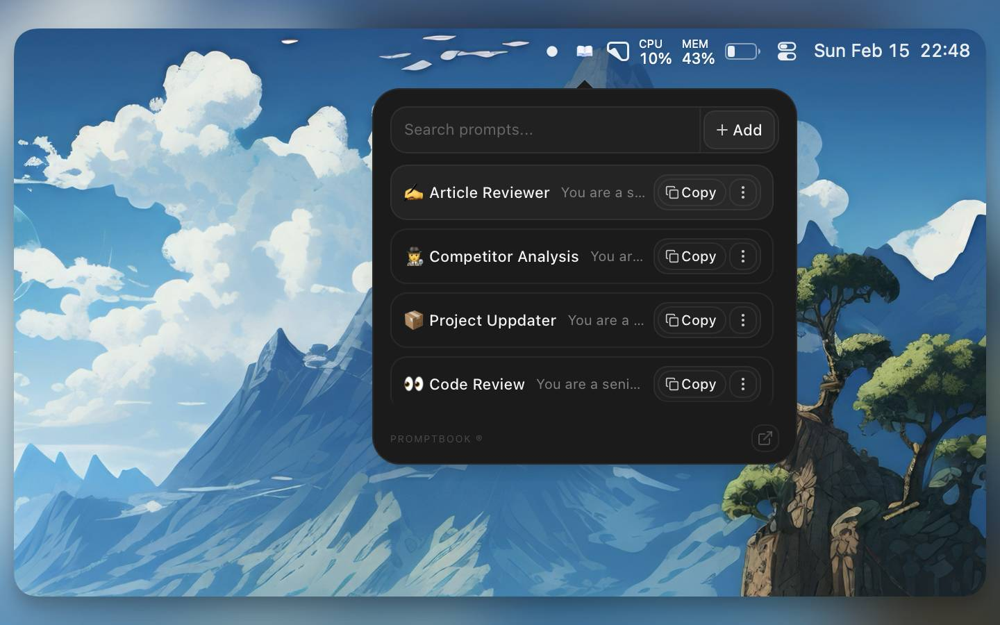

# Promptbook ® 📖

Fast macOS menu-bar prompt library built with Tauri v2 + React.

Store, search, edit, and instantly copy prompts from a compact menu-bar popover, with a full editor window when needed.

**[Download latest release](https://github.com/nikuscs/prompt-book/releases/latest)** (macOS, Apple Silicon)

## Screenshots

| Menu-bar popover | Editor window |
|:---:|:---:|
|  |  |

## Features

- Menu-bar popover for quick search + copy
- Full editor window with inline editing
- Autosave for title/content
- Prompt files stored on disk as markdown
- Keyboard shortcuts support

## Tech Stack

- Tauri v2 (Rust backend)
- React 19 + Vite
- Tailwind CSS v4
- Bun workspaces + Turborepo

## FAQ

### How do I install PromptBook?

Download the latest `.dmg` from [GitHub Releases](https://github.com/nikuscs/prompt-book/releases), open it, and drag PromptBook to your Applications folder.

### Where are my prompts saved?

Prompts are stored as markdown files in `~/.config/promptbook/`. Each prompt is a separate `.md` file with an `index.json` for ordering and metadata.

## Building from Source

Requires [Rust](https://rustup.rs/), [Bun](https://bun.sh/) v1.3.5+, and macOS with Xcode Command Line Tools.

```bash
git clone https://github.com/nikuscs/prompt-book.git
cd prompt-book
bun install
bun run tauri:dev
```
